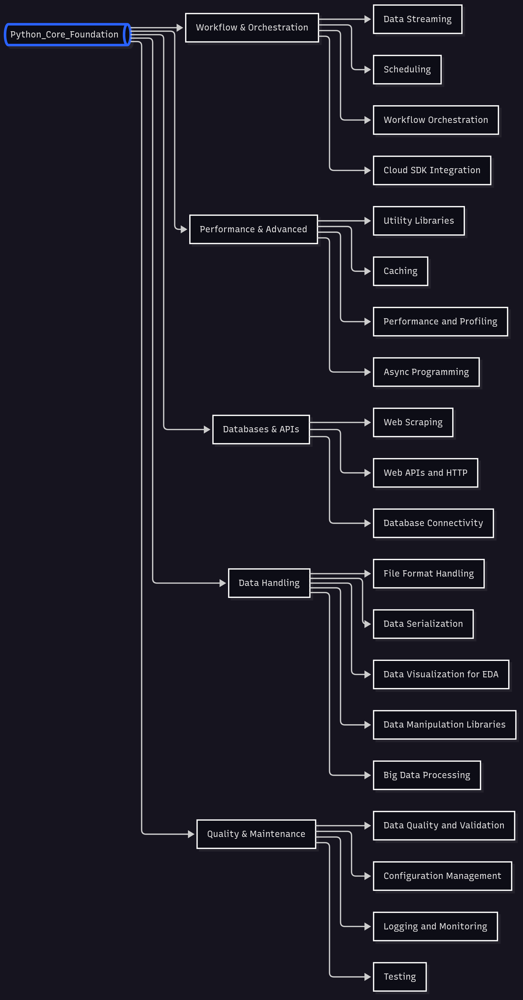
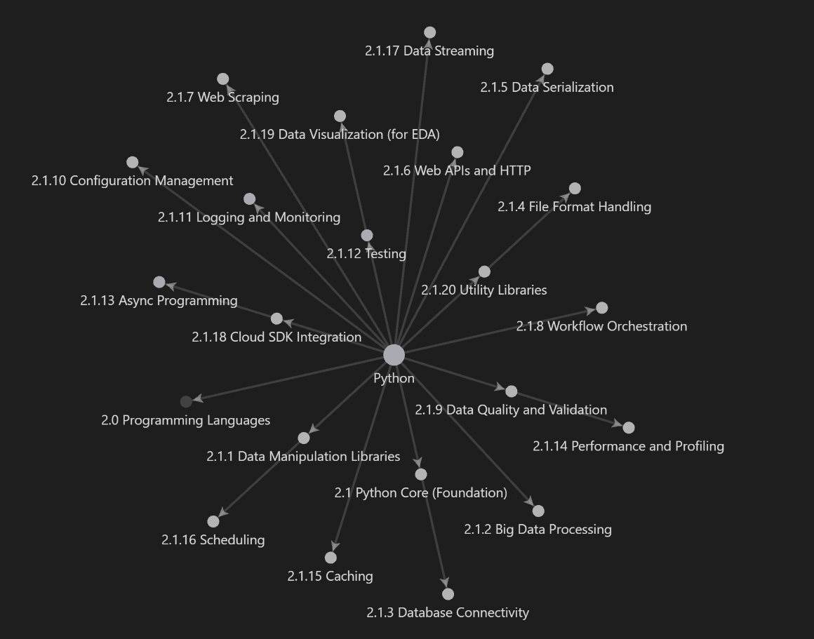

# Python Core Foundation

This repository contains structured learning resources for **Python Core Foundation**. Each topic includes a Markdown file with notes and an example Jupyter Notebook.

## Folder Structure

#### How to Use

1. Navigate to the desired topic folder.
2. Open the Markdown file to read notes and explanations.
3. Open the `example.ipynb` notebook to see code examples and try them out.

------

